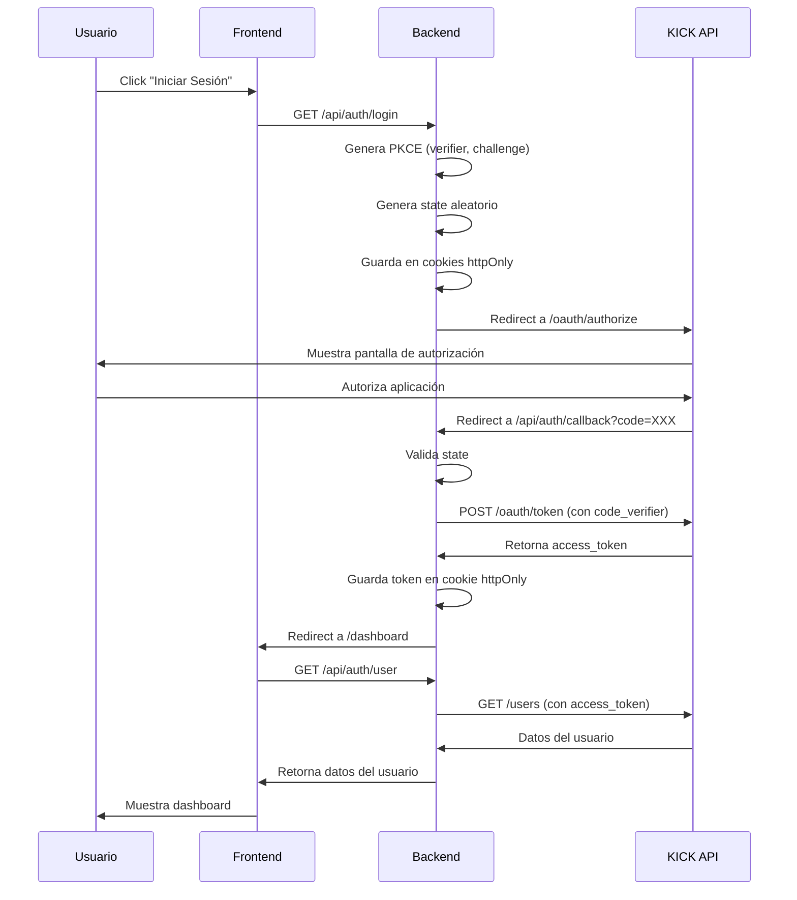

# FerIOX Kick App 🚀

Aplicación Full-Stack para integración segura con KICK API mediante OAuth 2.1

[](https://opensource.org/licenses/MIT)
[](https://nodejs.org/)
[](https://react.dev/)

---

## 📋 Descripción

FerIOX Kick App es una aplicación completa que permite la integración segura con la API de KICK mediante OAuth 2.1 con PKCE (Proof Key for Code Exchange). El proyecto implementa las mejores prácticas de seguridad y arquitectura moderna para aplicaciones full-stack.

### ✨ Características Principales

- 🔐 **OAuth 2.1 Seguro**: Implementación completa con PKCE y validación de estado
- ⚡ **Stack Moderno**: React + Vite para el frontend, Express.js para el backend
- 🛡️ **Seguridad**: Cookies httpOnly, Helmet, CORS configurado, protección CSRF
- 📚 **Documentación**: JSDoc completo y documentación Swagger para la API
- 🎨 **Código Limpio**: ESLint y Prettier configurados
- 🏗️ **Arquitectura**: Monorepo con separación clara de responsabilidades

---

## 🛠️ Tecnologías

### Backend
- **Node.js** (>= 18.0.0)
- **Express.js** 4.21.2
- **Axios** 1.12.2
- **Helmet** 8.1.0
- **CORS** 2.8.5
- **Cookie-parser** 1.4.7
- **Swagger** (JSDoc + UI Express)

### Frontend
- **React** 19.1.1
- **Vite** (rolldown-vite)
- **React Router DOM** 7.9.4
- **Axios** 1.12.2

### Herramientas de Desarrollo
- **ESLint** 8.57.0
- **Prettier** 3.2.5
- **Nodemon** 3.1.10

---

## 📁 Estructura del Proyecto

```
feriox-kickapp/
├── backend/              # Servidor Express.js
│   ├── server.js         # Punto de entrada del servidor
│   ├── swagger.js        # Configuración de Swagger
│   └── package.json      # Dependencias del backend
├── frontend/             # Aplicación React + Vite
│   ├── src/
│   │   ├── components/   # Componentes reutilizables
│   │   ├── context/      # Contextos de React (AuthContext)
│   │   ├── pages/        # Páginas de la aplicación
│   │   └── App.jsx       # Componente principal
│   ├── vite.config.js    # Configuración de Vite con proxy
│   └── package.json      # Dependencias del frontend
├── docs/                 # Documentación completa
│   ├── INSTALLATION.md   # Guía de instalación
│   ├── TECHNICAL_DOCUMENTATION.md
│   └── DEVELOPMENT.md    # Guía de desarrollo
├── .eslintrc.json        # Configuración de ESLint
├── .prettierrc.json      # Configuración de Prettier
└── package.json          # Scripts del monorepo
```

---

## 🚀 Inicio Rápido

### Prerrequisitos

- Node.js >= 18.0.0
- npm o yarn
- Cuenta de KICK con 2FA habilitado
- Aplicación creada en [KICK Dev](https://kick.com/settings/developer)

### Instalación

1. **Clonar el repositorio**
   ```bash
   git clone https://github.com/Defer1189/feriox-kickapp.git
   cd feriox-kickapp
   ```

2. **Instalar todas las dependencias**
   ```bash
   npm run install:all
   ```

3. **Configurar variables de entorno**
   ```bash
   cp backend/.env.example backend/.env
   # Editar backend/.env con tus credenciales de KICK
   ```

4. **Iniciar la aplicación**

   **Terminal 1 - Backend:**
   ```bash
   npm run dev:backend
   ```

   **Terminal 2 - Frontend:**
   ```bash
   npm run dev:frontend
   ```

5. **Abrir en el navegador**
   - Frontend: http://localhost:5173
   - Backend API: http://localhost:3000
   - Swagger Docs: http://localhost:3000/api/docs

---

## 📖 Documentación

### Guías Disponibles

- **[Guía de Instalación](./docs/INSTALLATION.md)** - Instalación paso a paso
- **[Documentación Técnica](./docs/TECHNICAL_DOCUMENTATION.md)** - Arquitectura y funcionamiento
- **[Guía de Desarrollo](./docs/DEVELOPMENT.md)** - Best practices y estándares

### API Documentation

Una vez que el servidor esté corriendo, accede a la documentación Swagger en:
```
http://localhost:3000/api/docs
```

---

## 🔐 Configuración de KICK Dev

1. Inicia sesión en [KICK](https://kick.com)
2. Activa 2FA en tu cuenta (obligatorio)
3. Ve a **Settings** → **Developer**
4. Crea una nueva aplicación
5. Configura:
   - **Name**: FerIOX Kick App
   - **Redirect URI**: `http://localhost:3000/api/auth/callback`
6. Guarda tu `client_id` y `client_secret`
7. Actualiza el archivo `backend/.env` con estas credenciales

---

## 🎯 Flujo de Autenticación OAuth 2.1



---

## 🔒 Seguridad

### Implementaciones de Seguridad

- ✅ **PKCE (Proof Key for Code Exchange)**: SHA256 challenge/verifier
- ✅ **State Parameter**: Prevención de ataques CSRF
- ✅ **HttpOnly Cookies**: Tokens no accesibles desde JavaScript
- ✅ **Secure Cookies**: Solo HTTPS en producción
- ✅ **Helmet**: Headers de seguridad HTTP
- ✅ **CORS**: Configurado para frontend autorizado únicamente
- ✅ **Input Validation**: Validación de todos los parámetros
- ✅ **Error Handling**: Sin exposición de detalles sensibles

### Scopes Solicitados

| Scope | Descripción | Uso |
|-------|-------------|-----|
| `user:read` | Leer información del usuario | Datos básicos del perfil |
| `channel:read` | Leer información del canal | Datos del canal |
| `channel:write` | Modificar metadata del canal | Actualizar stream |
| `chat:write` | Enviar mensajes en chat | Bots de chat |
| `streamkey:read` | Leer stream key (sensible) | Configuración de stream |
| `events:subscribe` | Suscribirse a webhooks | Notificaciones en tiempo real |
| `moderation:ban` | Acciones de moderación | Herramientas de moderación |

---

## 📊 Endpoints de la API

### Endpoints Públicos

| Método | Endpoint | Descripción |
|--------|----------|-------------|
| GET | `/api/health` | Health check del servidor |
| GET | `/api` | Información del servicio |
| GET | `/api/auth/login` | Inicia flujo OAuth |
| GET | `/api/auth/callback` | Callback OAuth |
| GET | `/api/docs` | Documentación Swagger |

### Endpoints Protegidos

| Método | Endpoint | Descripción |
|--------|----------|-------------|
| GET | `/api/auth/user` | Datos del usuario autenticado |
| POST | `/api/auth/logout` | Cerrar sesión |

---

## 🧪 Scripts Disponibles

```bash
# Desarrollo
npm run dev:backend          # Inicia backend en modo desarrollo
npm run dev:frontend         # Inicia frontend en modo desarrollo

# Instalación
npm run install:all          # Instala todas las dependencias

# Build
npm run build                # Build del frontend

# Calidad de Código
npm run lint                 # Ejecuta ESLint
npm run lint:fix             # Ejecuta ESLint y corrige automáticamente
npm run format               # Formatea código con Prettier
npm run format:check         # Verifica formato sin modificar
```

---

## 🤝 Contribuir

Las contribuciones son bienvenidas! Por favor:

1. Fork el proyecto
2. Crea una branch para tu feature (`git checkout -b feature/AmazingFeature`)
3. Commit tus cambios (`git commit -m 'feat: Add some AmazingFeature'`)
4. Push a la branch (`git push origin feature/AmazingFeature`)
5. Abre un Pull Request

Lee la [Guía de Desarrollo](./docs/DEVELOPMENT.md) para más detalles sobre estándares y best practices.

---

## 📄 Licencia

Este proyecto está bajo la Licencia MIT - ver el archivo [LICENSE](./LICENSE) para más detalles.

---

## 👨‍💻 Autor

**FerIOX**

- GitHub: [@Defer1189](https://github.com/Defer1189)
- Proyecto: [feriox-kickapp](https://github.com/Defer1189/feriox-kickapp)

---

## 🙏 Agradecimientos

- [KICK](https://kick.com) por su API pública
- La comunidad de desarrolladores de React y Express.js
- Todos los contribuidores del proyecto

---

## 📞 Soporte

Si encuentras algún problema o tienes preguntas:

1. Revisa la [documentación](./docs/)
2. Busca en los [issues existentes](https://github.com/Defer1189/feriox-kickapp/issues)
3. Crea un [nuevo issue](https://github.com/Defer1189/feriox-kickapp/issues/new) si es necesario

---

## 🗺️ Roadmap

- [ ] Implementar refresh token rotation
- [ ] Agregar tests unitarios e integración
- [ ] Implementar webhooks de KICK
- [ ] Dashboard con estadísticas en tiempo real
- [ ] Sistema de notificaciones
- [ ] Docker y Docker Compose
- [ ] CI/CD con GitHub Actions
- [ ] Soporte para TypeScript

---

<div align="center">

**Desarrollado con ❤️ por FerIOX**

*Escalado Horizontal, Ambición Vertical*

</div>