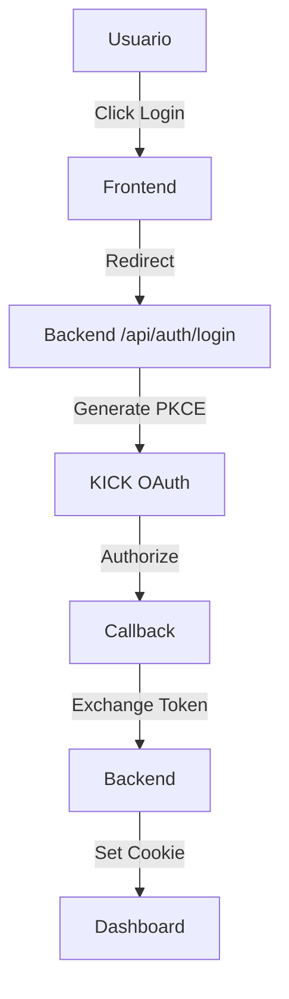

# Documentación - FerIOX Kick App

Esta carpeta contiene toda la documentación técnica del proyecto.

## 📚 Documentos Disponibles

### [Guía de Instalación](./INSTALLATION.md)
Instrucciones paso a paso para instalar y configurar el proyecto localmente.

**Contenido:**
- Requisitos previos
- Instalación de dependencias
- Configuración de variables de entorno
- Creación de aplicación en KICK Dev
- Verificación de la instalación
- Solución de problemas comunes

**Ideal para:** Nuevos desarrolladores que quieren empezar rápidamente.

---

### [Documentación Técnica](./TECHNICAL_DOCUMENTATION.md)
Documentación completa de la arquitectura, componentes y funcionamiento del sistema.

**Contenido:**
- Descripción general del proyecto
- Arquitectura del sistema
- Configuración del entorno
- Documentación del backend
- Documentación del frontend
- Flujo de autenticación OAuth 2.1
- Implementaciones de seguridad
- API Endpoints
- Scopes de KICK
- Guía de despliegue

**Ideal para:** Entender a fondo cómo funciona el sistema.

---

### [Guía de Desarrollo](./DEVELOPMENT.md)
Best practices, estándares de código y flujo de trabajo para desarrolladores.

**Contenido:**
- Configuración del entorno de desarrollo
- Estructura del proyecto
- Flujo de trabajo Git
- Estándares de código
- Testing
- Debugging
- Mejores prácticas

**Ideal para:** Desarrolladores que van a contribuir al proyecto.

---

## 🚀 Inicio Rápido

Si es tu primera vez con este proyecto:

1. **Lee primero:** [Guía de Instalación](./INSTALLATION.md)
2. **Luego:** [Documentación Técnica](./TECHNICAL_DOCUMENTATION.md)
3. **Para contribuir:** [Guía de Desarrollo](./DEVELOPMENT.md)

---

## 🔗 Enlaces Útiles

### Documentación Externa
- [KICK Dev Documentation](https://dev.kick.com)
- [OAuth 2.1 Specification](https://oauth.net/2.1/)
- [PKCE RFC 7636](https://datatracker.ietf.org/doc/html/rfc7636)
- [Express.js Documentation](https://expressjs.com/)
- [React Documentation](https://react.dev)
- [Vite Documentation](https://vitejs.dev/)

### API Documentation
- **Swagger UI:** http://localhost:3000/api/docs (cuando el servidor esté corriendo)

---

## 📝 Convenciones de Documentación

### Formato Markdown
Toda la documentación está escrita en Markdown para fácil lectura y versionado.

### Emojis
Usamos emojis para facilitar la navegación visual:
- 📚 Documentación
- 🚀 Inicio rápido / Despliegue
- ⚙️ Configuración
- 🔐 Seguridad
- ✅ Buenas prácticas
- ❌ Malas prácticas
- ⚠️ Advertencias
- 💡 Tips

### Bloques de Código
```bash
# Los comandos de terminal están en bloques bash
npm install
```

```javascript
// El código JavaScript está en bloques javascript
const example = 'código de ejemplo';
```

### Enlaces Internos
Los enlaces entre documentos usan rutas relativas:
```markdown
[Guía de Instalación](./INSTALLATION.md)
```

---

## 🤝 Contribuir a la Documentación

Si encuentras errores o quieres mejorar la documentación:

1. Crea un issue describiendo el problema o mejora
2. O crea un PR directamente con los cambios
3. Asegúrate de seguir el mismo estilo y formato

### Checklist para Nuevos Documentos

- [ ] Título claro y descriptivo
- [ ] Tabla de contenidos para documentos largos
- [ ] Bloques de código con syntax highlighting
- [ ] Screenshots cuando sea apropiado
- [ ] Enlaces a recursos relacionados
- [ ] Ejemplos prácticos
- [ ] Sección de troubleshooting (si aplica)

---

## 📊 Diagramas

Para diagramas complejos, usamos:
- **Texto ASCII** para diagramas simples
- **Mermaid** para diagramas de flujo (GitHub lo renderiza automáticamente)

Ejemplo de diagrama Mermaid:


---

## 📞 Contacto

Si tienes preguntas sobre la documentación:
- Crea un issue en GitHub
- Contacta al equipo de desarrollo

---

**Desarrollado por FerIOX**  
*Escalado Horizontal, Ambición Vertical*
